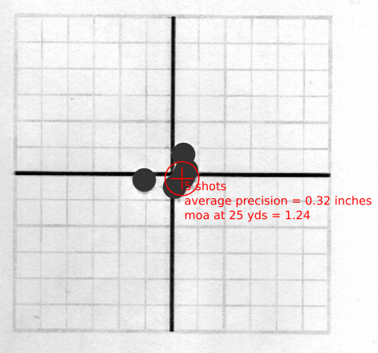

# inkscape-extension-target
Inkscape extension to calculate average precision circle and minutes of angle (moa) for a shot group

Quick Start
-----------
1. download and install inkscape https://inkscape.org/
2. copy target.py and target.inx to the directory specified in Edit->Preferences->System->User Extensions
3. scan in some targets
4. import a target into inkscape
5. draw some circles over the hole locations
6. select the circles
7. go to extensions->render->target
8. enter your target distance (100 yards by default)
9. click Apply and get something like this...

